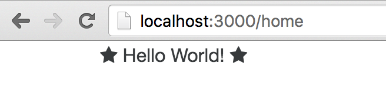
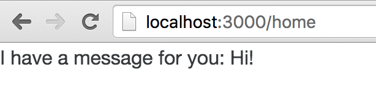

### EX 00 - Setup
- Setup was easy. I didnt run into any issues. 
- I had node installed previously.
- There is an issue with a image under:
  - "Beginner Path: Use a Starter Repository" 
  - "Configure TypeScript"
  - "Install and Start a Local Server"
- Maybe put "Choose an Editor" and "installing Angular 2" under the same chapter to get the exercises and chapter names to match up

### EX 01 - Hello World
- 3. Hello World explained what is going on here well.

### EX 02 - Create a Component 
- Change the gitbook title to "Create a Component" or this to "First Component"
- "Whats that syntax?" is blank.
- Names of files in gitbook are different than in example code. "home" here and "first.component.ts" in gitbook
- does the `selector` have to be the same as the class you export?
  - here the selector is 'first' when the class we export is First.
- The message doesnt seem to be showing up.
  - the data in the `first` component is not displayed in the browser.
  - do i put the {{message}} in the `first` component? or does this go in the parent component. not sure
  - is this how its supposed to look?
  

  