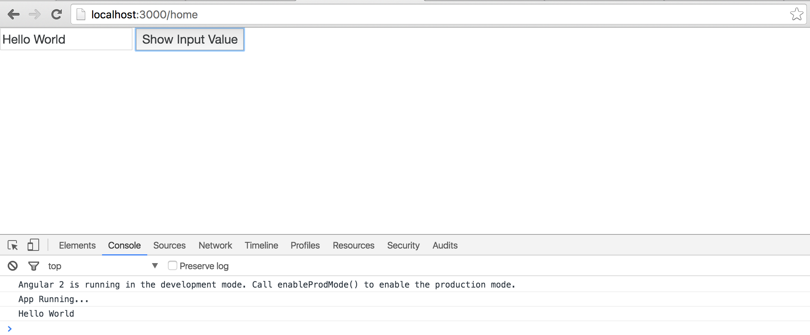
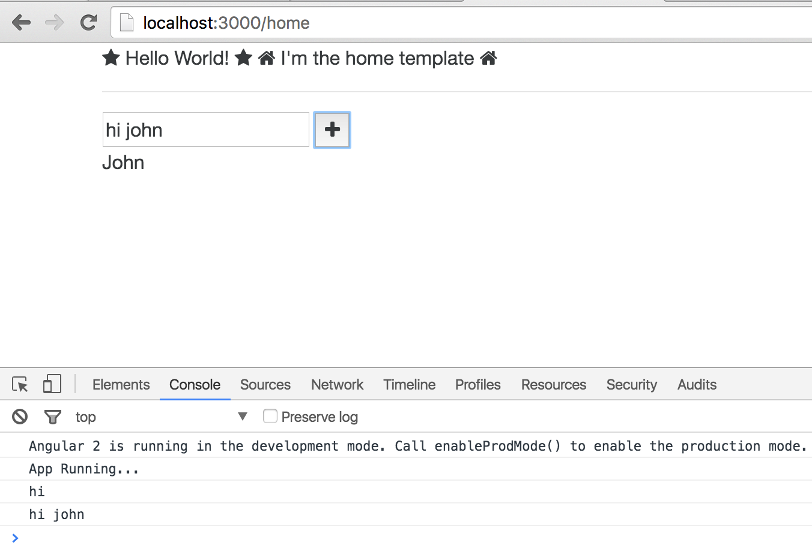
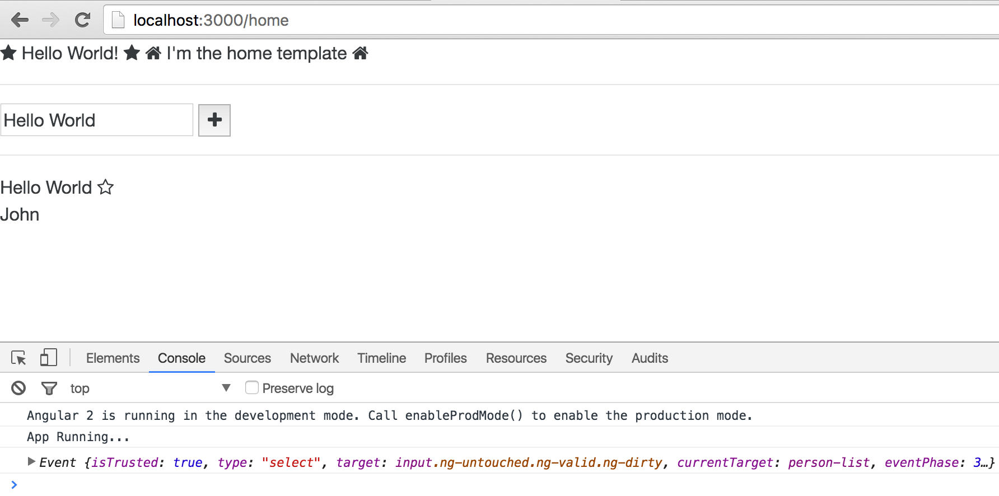
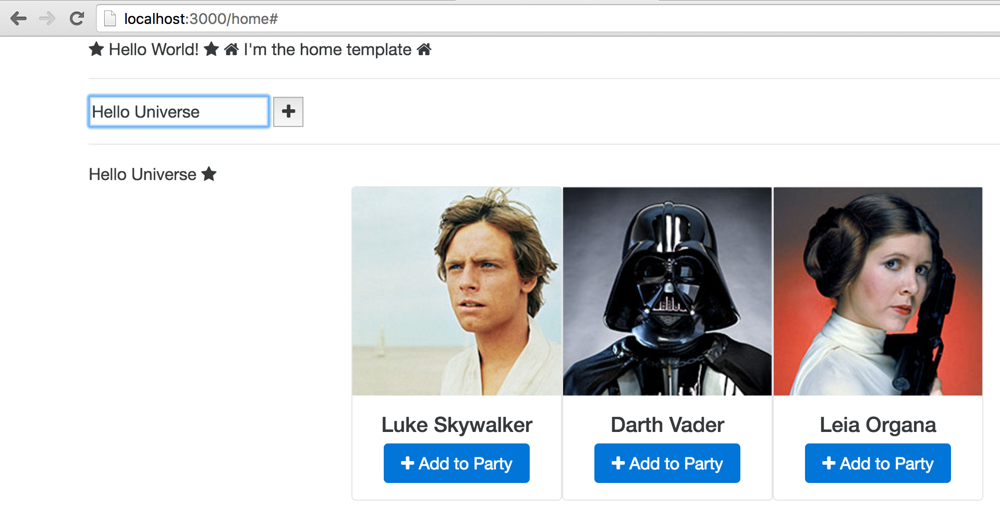
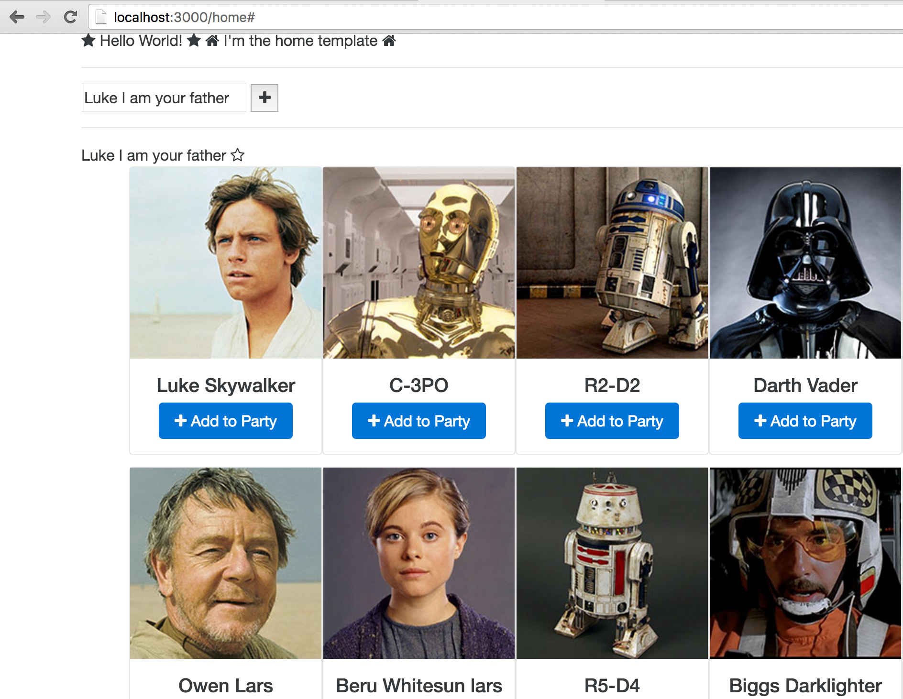
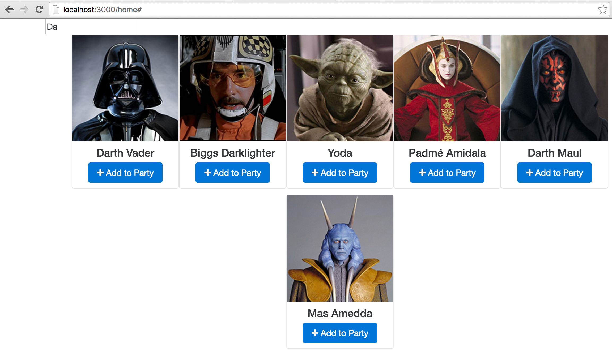
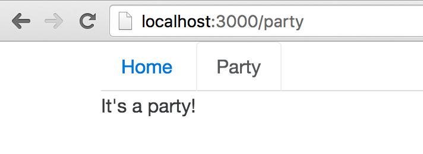

# Take Aways
- I felt like have have come away with the basics of ng2
- Starting webpack over and over again (when an exercise is renamed to src) was somewhat annoying (being nit picky)
- The Book is a good reference. Not sure if it was meant to be uncompleted or not.
- I want to see how you pass data inbetween routes. 
  - I ran into this problem with react and had to go with Redux.
- Integration with typescript seems nice. as does integration with RXjs 
- I would feel glad i spent money on a workshop with this content.

### EX 00 - Setup
- Setup was easy. I didnt run into any issues. 
- I had node installed previously.
- There is an issue with a image under:
  - "Beginner Path: Use a Starter Repository" 
  - "Configure TypeScript"
  - "Install and Start a Local Server"
- Maybe put "Choose an Editor" and "installing Angular 2" under the same chapter to get the exercises and chapter names to match up

### EX 01 - Hello World
- 3. Hello World explained what is going on here well.


### EX 02 - Create a Component 
- Change the gitbook title to "Create a Component" or this to "First Component"
- "Whats that syntax?" is blank.
- Names of files in gitbook are different than in example code. "home" here and "first.component.ts" in gitbook
- does the `selector` have to be the same as the class you export?
  - here the selector is 'first' when the class we export is First.
- The message doesnt seem to be showing up.
  - the data in the `first` component is not displayed in the browser.
  - do i put the {{message}} in the `first` component? or does this go in the parent component. not sure
  - is this how its supposed to look?
  

  
### EX 03 - Handling Clicks and Refs
- "Whats that Syntax?" needs to be filled in. Maybe go over #myInput in the input?
- looks like when you change a directory name "03" -> "src" you need to restart webpack. is there a way to do this automatically?



### EX 04 - Smart and Dumb Components
- Something that is confusing me is what goes in the `@Component` versus what goes in the class. Looks like data goes in the class and the `@Component` is declarative
  - As I type this out it, it makes sense that the decorator is giving the home class these attributes :smile:
- Is it a Common Convention to have classes like this: `PersonList` and selectors for that class like this: `person-list`?
- I didnt have to write any code for this to work. Not sure if that is how you want it set up.



### EX 05 - Templates, Styles, and Built-in Directives
- broken image under:
    - Gotchas
    - NgSwitchDefault *ngSwitchDefault
- "consistently always" seems redundant :D (under gotchas)
- good explanations. Answered my question about `*` at the end.
  


### EX 06 - Repeating Elements with ngFor
- broken image under:
    - Gotchas
- wooo lots of code to add.
- looks like the instruction "add `card` to the `PersonList`" has the wrong code attached to it.
What it has:
``` html
div class="card">
  
  <div class="info">
<h5>{{person.name}}</h5>
<a href="#" class="btn btn-primary"><i class="fa fa-plus"></i> Add to Party</a>
  </div>
</div>
```

What I think it should be:
``` html
<div class="card-container">
  <card
    *ngFor="#person of people"
    [person]="person">
  </card>
</div>
```

- For some reason I think of `@Input()` as sort of "PropTypes" for this component. Just the first thing I thought of
- In the readme you say "add the `{{person.name}}` to the `h4`" but in the example code its an `h5` :wink:



### Exercise 7 - Move the Data to a Service
- After just reading http://nosy-dirt.surge.sh/injecting-services/index.html I was not sure how to use a service.
- The example makes this clear though. 
- My understanding is:
  - You inject the service into the smart component, In this case home.
  - You then make the service available to child components passing them done like this: `[people]=starWars.people`
  - The PersonList now has each person from the service to give to the card.
  


### EX 08 - Loading Data with Http
- broken image under:
    - Gotchas
- uh oh - async pipe :scream:
- In book you have `const STARWARS_API = 'http://localhost:5000';` but the apiserver is on port 4000 :simple_smile:
- Has the same explanation of `@Injectable` and "Importing vs Injecting" as chapter 09 or "Injecting Services"
- The | async is soooo cool. Ive been dealing with rendering data from a backend server in react... this seems elegant comparatively.
- The code in the gitbook has extra things going on (starwars service):

``` javascript
@Injectable()
export class StarWarsService{
    people = this._http.get(`${STARWARS_API}/people`)
            .map(res => res.json());    

    starships = this._http.get(`${STARWARS_API}/starships`)
            .map(res => res.json());

    vehicles = this._http.get(`${STARWARS_API}/vehicles`)
            .map(res => res.json());

    constructor(private _http:Http){}
}
```

Where the example code has this: 
``` javascript
@Injectable()
export class StarWars{
  people;
  constructor(private _http:Http){
    this.people = _http.get(`${API}/people`)
      .map(res => res.json() //get the response as json
        .map(person =>
          Object.assign(person, {image: `${API}/${person.image}`})
        )
      )
  }
}
```

And then it says that the home component has this:

``` html
@Component({
    selector: 'home',
    template: `
        <h2>People</h2>
        <div *ngFor="#person of starwarsService.people | async">
        {{person.name}}
      </div>

      <h2>Starships</h2>
        <div *ngFor="#starship of starwarsService.starships | async">
        {{starship.name}}
      </div>

      <h2>Vehicles</h2>
        <div *ngFor="#vehicle of starwarsService.vehicles | async">
        {{vehicle.name}}
      </div>
    `
})
```

when it actually has this:

``` html
@Component({
  selector: 'home',
  directives: [PersonList],
  providers: [StarWars],
  template: `
    <i class="fa fa-home" aria-hidden="true"></i>
    <span>I'm the home template</span>
    <i class="fa fa-home" aria-hidden="true"></i>
    
    <hr>
    
    <person-list (select)="onSelect($event)" [people]="starWars.people | async"></person-list>
`
})
```




### EX 09 - Searching Data with a Pipe?
- EX09 is never mentioned in the instructions (im guessing the second ex08 is supposed to be 9)
- No chapter in the gitbook for this example.
- pipes seem relatively easy to use



### EX 10 - Adding Routes
- No chapter in the gitbook for this example.
- TIL: Decorators are and awesome way to declare what a componet does.



